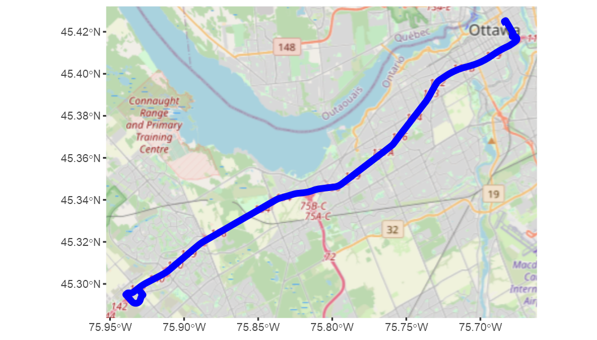
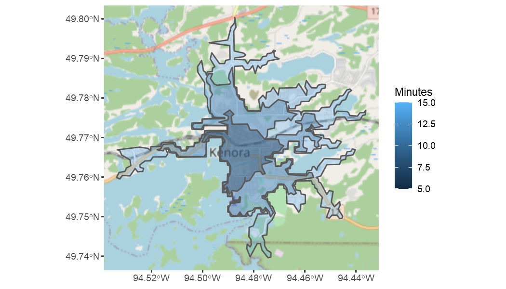
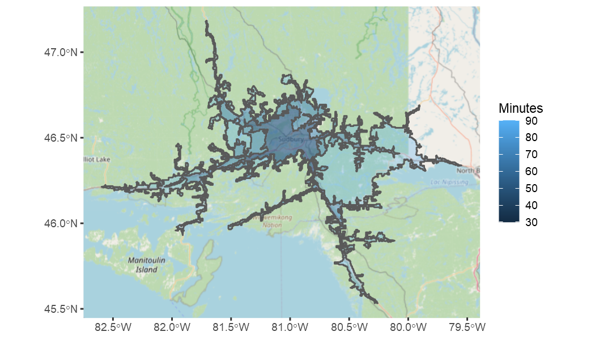

<!-- README.md is generated from README.Rmd. Please edit that file -->

# valhallr: A Tidy Interface to the Valhalla Routing Engine

This package provides an R-native interface to the Valhalla routing
engine’s APIs for turn-by-turn routing, isochrones, and
origin-destination analyses. It also includes several user-friendly
functions for plotting outputs, and strives to follow “tidy” design
principles. **Please note** that this package requires access to a
running Valhalla instance.

# Step 0: Install and run Valhalla

This package provides an R-native interface to the Valhalla routing
engine, and assumes that you have access to a running Valhalla instance.
If you don’t, you won’t be able to use any of the functions described in
this vignette\! Installing and configuring Valhalla is far out of scope
for this vignette, but Valhalla is open-source and there are several
free resources that you might find helpful.

Here are some example resources to help you get Valhalla up and running:

  - Valhalla’s GitHub page has all of the source code and discussions
    and issue trackers: <https://github.com/valhalla/>
  - Valhalla’s API documentation has a lot of detailed information:
    <https://valhalla.readthedocs.io/en/latest/>
  - GIS-OPS has a helpful guide for installing and running Valhalla:
    <https://gis-ops.com/valhalla-part-1-how-to-install-on-ubuntu/>

The rest of this vignette assumes a running Valhalla instance on
localhost at the default port 8002.

# Turn-by-turn routing

The function `valhallr::route()` uses Valhalla to generate detailed
turn-by-turn routing from an origin to a destination. It’s
straightforward to use: you provide origin and destination coordinates
in tibbles with `lat` and `lon` columns, along with any number of
optional options, and the API returns an object containing the resulting
trip.

This example shows how to generate driving directions between the
University of Ottawa and the Canadian Tire Centre, a stadium in Ottawa.
It gets these coordinates from the function `valhallr::test_data()`,
which can return coordinates for several points of interest around
Ontario. It then calls `valhallr::route()` between these two locations
with all default options, and then passes the result to
`valhallr::print_trip()`.

``` r
library(valhallr)

from <- test_data("uottawa")
to <- test_data("cdntirecentre")
t <- route(from, to)

print_trip(t)
#> From lat/lng: 45.4234, -75.6832
#> To   lat/lng: 45.2975, -75.9279
#> Time: 19.9 minutes
#> Dist: 28.693 km
```

We can see that Valhalla has generated a trip from uOttawa to the
Canadian Tire Centre that’s 28.693km long and would take 19.9 minutes to
drive. But what does the trip look like?

We can answer this question with the function `valhallr::map_trip()`
that takes the Valhalla trip object, decodes an embedded shapefile, and
plots the result on a map. (You can use `valhallr::decode()` to extract
the shapefile yourself for other purposes.) The `map_trip()` function
supports an interactive map using **leaflet** or an static map using
**ggplot2**. Here we’ll generate a static map.

``` r
map_trip(t, method = "ggplot")
```



What if we wanted to travel by bicycle instead? We can change our travel
method from the default, “auto”, using the `costing` parameter. Here we
set it to “bicycle” and re-run the command:

``` r
t <- route(from, to, costing = "bicycle")

print_trip(t)
#> From lat/lng: 45.4234, -75.6832
#> To   lat/lng: 45.2975, -75.9279
#> Time: 108 minutes
#> Dist: 30.028 km
```

This new trip is a bit longer at 30.028km, and would take quite a bit
longer at 108 minutes. When we map it, we can see that Valhalla has
given us a plausible cycling trip that takes a scenic route along the
riverside path and avoids major highways:

``` r
map_trip(t, method = "ggplot")
```


# Origin-destination analyses

Many analyses require the shortest distance or time between a large
number of locations without needing to know the specific routes taken.
Sometimes this information is presented in origin-destination (OD)
matrices or OD tables, which simply show the shortest travel
distances/times between source locations and target locations. Valhalla
has an API called “sources\_to\_targets” to generate this information.
The **valhallr** package has two functions that call this API:
`valhallr::sources_to_targets()` calls it directly and provides
fine-grained access to configuration options, and `valhallr::od_table()`
provides a higher-level interface with several user-friendly features.
We’ll look at each function in turn.

In this example, we need to find the shortest distances and times
between three source locations (the Canadian parliament buildings, the
University of Ottawa, and the CN Tower) and two destination locations
(the Canadian Tire Centre in Ottawa, and Zwicks Island Park in
Belleville).

To create an OD table, we set up our sources in a tibble called `froms`,
our targets in a tibble called `tos`, and then pass them to
`sources_to_targets()` using all default options.

``` r
library(dplyr)
froms <- bind_rows(test_data("parliament"), test_data("uottawa"), test_data("cntower"))
tos <- bind_rows(test_data("cdntirecentre"), test_data("zwicksisland"))

st <- sources_to_targets(froms, tos)

st %>%
  knitr::kable()
```

| distance |  time | to\_index | from\_index |
| -------: | ----: | --------: | ----------: |
|   29.498 |  1232 |         0 |           0 |
|  273.969 | 10170 |         1 |           0 |
|   28.693 |  1194 |         0 |           1 |
|  273.164 | 10131 |         1 |           1 |
|  389.276 | 15963 |         0 |           2 |
|  190.912 |  7189 |         1 |           2 |

`sources_to_targets()` returns results as they come from Valhalla, which
has two disadvantages. First, it strips all human-readable names from
the inputs and only returns zero-indexed identifiers. And second, the
API call can fail for large requests with hundreds or thousands of
locations if Valhalla runs out of memory.

The `valhallr::od_table()` function addresses these two problems by
letting you specify human-readable names for each location, and by
letting you send origin rows to Valhalla in batches. The trade-off is
that `od_table()` doesn’t give as fine-grained access to the underlying
API, but it’s easier and faster for many purposes.

Here we can see the results of calling `od_table()` with the same inputs
as before, this time specifying the names of the human-readable id
columns in each input tibble:

``` r
od <- od_table (froms = froms,
                from_id_col = "name",
                tos,
                to_id_col = "name")

od %>%
  knitr::kable()
```

| name\_from | name\_to      | distance |  time |
| :--------- | :------------ | -------: | ----: |
| parliament | cdntirecentre |   29.498 |  1232 |
| parliament | zwicksisland  |  273.969 | 10170 |
| uottawa    | cdntirecentre |   28.693 |  1194 |
| uottawa    | zwicksisland  |  273.164 | 10131 |
| cntower    | cdntirecentre |  389.276 | 15963 |
| cntower    | zwicksisland  |  190.912 |  7189 |

The results are much easier to read, and would be simpler to feed
forward into a further analysis (e.g. by left-joining with the original
inputs to get the lat/lon information for mapping).

Although this example didn’t use batching, note that this can be
essential for larger analyses and seems especially important when using
“pedestrian” costing. For some analyses I’ve been able to use a batch
size of 100 for “auto” costing but have had to scale down to a batch
size of 5 for “pedestrian” costing.

# Isochrones

Finally, **valhallr** provides access to Valhalla’s isochrone API
through the function `valhallr::isochrone()`. An isochrone, also known
as a service area, is a polygon that shows the area reachable from a
starting point by traveling along a road network for a certain distance
or time. This function lets you provide a starting point’s latitude and
longitude, a distance or time metric, and a vector of distances/times,
and if it’s successful it returns an sf-class tibble of polygons.

For example, how far can you get from downtown Kenora on a bicycle using
the default values of 5, 10, and 15 minutes?

``` r
# set up our departure point: the University of Ottawa
from <- test_data("kenora")

# generate an isochrone for travel by bicycle
i <- valhallr::isochrone(from, costing = "bicycle")

# map the isochrone
map_isochrone(i, method = "ggplot")
```



Pretty far, by the looks of it\! You can see how the isochrones follow
the road network, and so give a reasonably realistic estimate of how far
you could travel.

For another example, how far can you drive from Sudbury’s Big Nickel in
30, 60, and 90 minutes?

``` r
from <- test_data("bignickel")

i <- valhallr::isochrone(from, costing = "auto", contours = c(30,60,90), metric = "min")

map_isochrone(i, method = "ggplot")
```



Again, quite far\! You can see how the algorithm takes the road network
and speed limits into account: once you get onto a major highway, the
distances increase rapidly.
