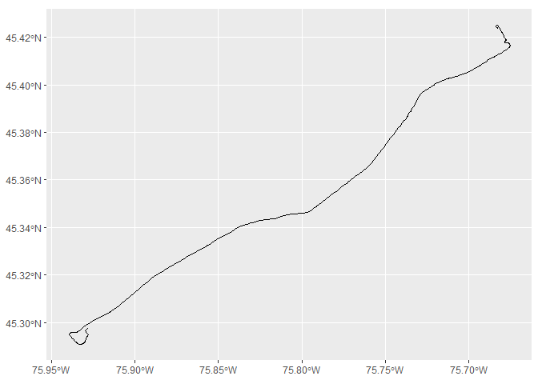
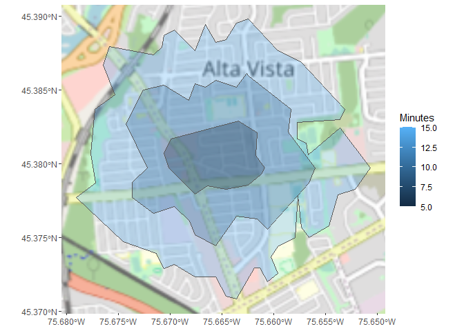

<!-- README.md is generated from README.Rmd. Please edit that file -->

# valhallr

<!-- badges: start -->

<!-- badges: end -->

This package provides an R-native interface to the Valhalla routing
engine’s API.

  - [API
    Documentation](https://valhalla.readthedocs.io/en/latest/api/turn-by-turn/api-reference/)

# Extremely Experimental\!

This library is under active development and extremely experimental.
Many things work but lots don’t, there’s little input validation, the
API wrappers are not up to best practicesc yet, the documentation is a
work in progress, and you can expect functions and parameters to change.

# Examples

## Turn-by-turn directions

This example shows how we can easily get turn-by-turn driving directions
using many default parameters. Here’s a driving trip from the University
of Ottawa to the Canadian Tire Centre (an arena across town).

``` r
library(valhallr)
library(magrittr)
library(dplyr)
library(tibble)
library(tidyr)

origin <- valhallr::test_data("uottawa")
destination <- valhallr::test_data("cdntirecentre")

trip <- valhallr::valhalla_route(from = origin, to = destination)

valhallr::print_trip(trip, all_details = TRUE)
#> From lat/lng: 45.4234, -75.6832
#> To   lat/lng: 45.2975, -75.9279
#> Time: 19.9 minutes
#> Dist: 28.693 km
#> Step 1: Drive northwest on Copernicus Street.
#>    Dist: 0.17 km
#>    Time: 0.35 minutes
#> Step 2: Turn right onto Laurier Avenue East/48.
#>    Dist: 0.08 km
#>    Time: 0.19 minutes
#> Step 3: Turn right onto King Edward Avenue.
#>    Dist: 0.77 km
#>    Time: 1.38 minutes
#> Step 4: Turn right onto Greenfield Avenue.
#>    Dist: 0.20 km
#>    Time: 0.23 minutes
#> Step 5: Turn left to take the 417 ramp.
#>    Dist: 24.97 km
#>    Time: 15.09 minutes
#> Step 6: Take exit 142 on the right onto 88/Palladium Drive.
#>    Dist: 0.73 km
#>    Time: 0.73 minutes
#> Step 7: Turn left onto Palladium Drive/88.
#>    Dist: 1.35 km
#>    Time: 1.34 minutes
#> Step 8: Turn left onto Huntmar Drive.
#>    Dist: 0.21 km
#>    Time: 0.35 minutes
#> Step 9: Turn right onto Cyclone Taylor Boulevard.
#>    Dist: 0.21 km
#>    Time: 0.24 minutes
#> Step 10: Your destination is on the right.
#>    Dist: 0.00 km
#>    Time: 0.00 minutes
```

## Mapping turn-by-turn routes

And we can decode the API’s encoded shapefile and map our turn-by-turn
trip with the convenience function `valhallr::map_trip()`. Leaflet and
ggplot are both supported; here we’ll use ggplot since GitHub documents
seem not to support embedded HTML Leaflet maps.

``` r
valhallr::map_trip(trip, method = "ggplot")
```



## Origin-Destination analyses

There is also some basic support for origin-destination (OD) analyses
using Valhalla’s `sources_to_targets` method. You can either call the
method directly with `valhallr::sources_to_targets()`, or else use
`valhallr::od_matrix()` which has some convenience features like
human-readable name columns.

``` r
origins <- bind_rows(test_data("uottawa"), test_data("cntower"))
destinations <- bind_rows(test_data("cdntirecentre"), test_data("parliament"))

od <- valhallr::od_matrix(froms = origins, 
                          from_id_col = "name", 
                          tos = destinations, 
                          to_id_col = "name",
                          costing = "auto",
                          batch_size = 100,
                          minimum_reachability = 500)

od %>%
  mutate(time = time / 3600,
         time = round(time, digits = 2)) %>%
  knitr::kable(col.names = c("Origin", "Destination", "Distance (km)", "Time (h)"))
```

| Origin  | Destination   | Distance (km) | Time (h) |
| :------ | :------------ | ------------: | -------: |
| uottawa | cdntirecentre |        28.693 |     0.33 |
| uottawa | parliament    |         1.850 |     0.05 |
| cntower | cdntirecentre |       389.276 |     4.43 |
| cntower | parliament    |       454.637 |     4.61 |

## Isochrones

There is also a rudimentary function `valhallr::isochrone()` for
generating isochrones, which are polygons showing how far you can travel
in a given time from a given location. You specify a lat/lon origin in a
tibble, and it returns an `sf` object with the according polygons.

This simple example shows how to generate 5, 10, and 15-minute walking
isochrones:

``` r
library(sf)

origin <- valhallr::test_data("myhouse")

isochrones <- valhallr::isochrone(from = origin)

isochrones
#> Simple feature collection with 3 features and 8 fields
#> geometry type:  POLYGON
#> dimension:      XY
#> bbox:           xmin: -75.67904 ymin: 45.37081 xmax: -75.6507 ymax: 45.38982
#> geographic CRS: WGS 84
#> # A tibble: 3 x 9
#>   fill  fillOpacity fill.opacity fillColor color contour opacity metric
#>   <chr>       <dbl>        <dbl> <chr>     <chr>   <int>   <dbl> <chr> 
#> 1 #bf4~        0.33         0.33 #bf4040   #bf4~      15    0.33 time  
#> 2 #bfa~        0.33         0.33 #bfaa40   #bfa~      10    0.33 time  
#> 3 #6ab~        0.33         0.33 #6abf40   #6ab~       5    0.33 time  
#> # ... with 1 more variable: geometry <POLYGON [°]>
```

There’s also a simple function to map them via Leaflet or ggplot:

``` r
valhallr::map_isochrone(isochrones, method = "ggplot")
```



## Installation

You can install the developer version from GitHub.
